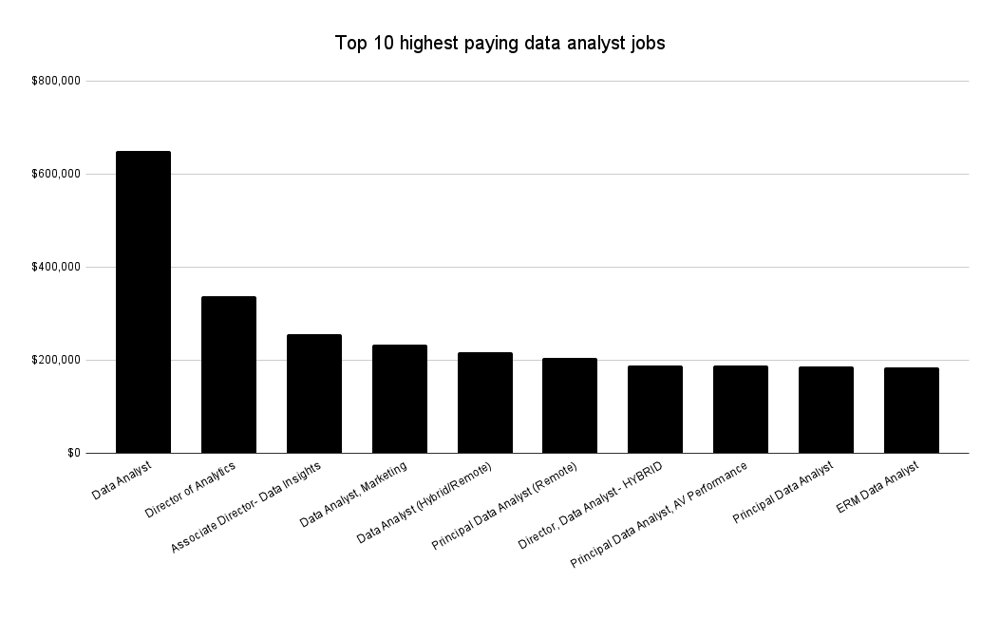
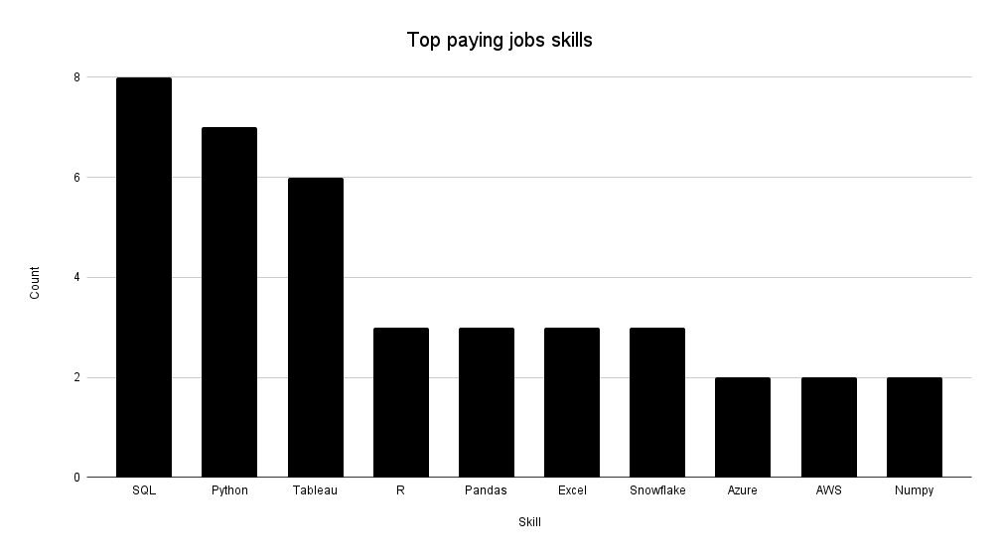
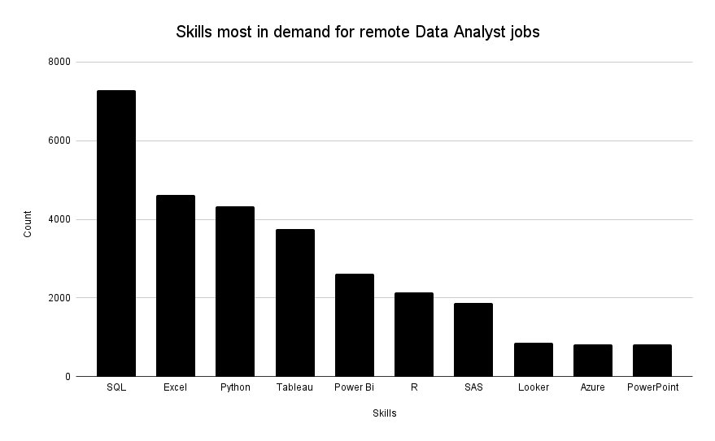
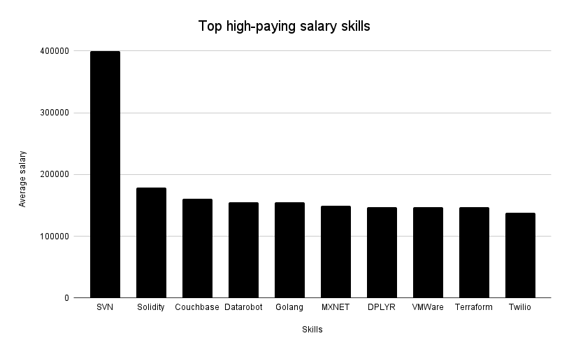
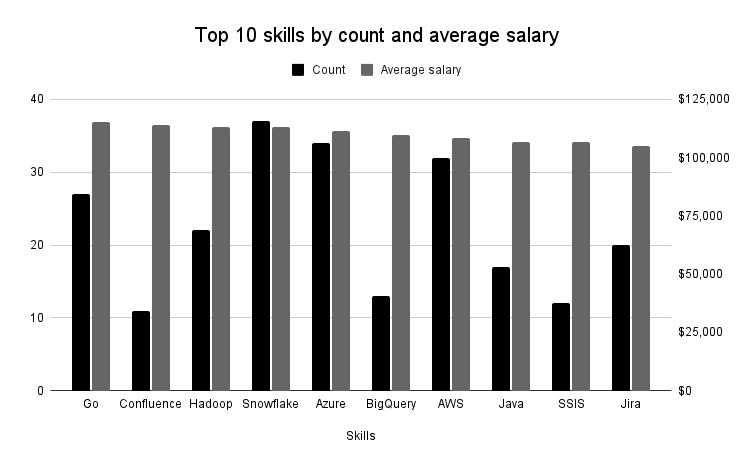

# Introduction

This project explores the top-paying jobs within data analytics and I discover the most in-demand skills for those roles.

This is my first data analytics project and I followed a guide on YouTube linked below. Questions 1-5 are straight from the course but I also added questions 6-8 to test myself.
[SQL for Data Analytics](https://www.youtube.com/watch?v=7mz73uXD9DA)

### Original questions

1. What are the top-paying data analyst jobs?
2. What skills are required for these top-paying jobs?
3. What skills are most in demand for data analysts?
4. Which skills are associated with higher salaries?
5. What are the most optimal skills to learn?

### Additional questions

6. Which companies offer the highest average salary?
7. What percentage of jobs are remote (work from home)?
8. Which job titles have the highest average salary?

Here are all the SQL queries: [project_sql folder](/project_sql/)

# Tools I Used

For my deep dive into the data analyst job market, I harnessed the power of several key tools:

- SQL
- PostgreSQL
- Visual Studio Code
- Git & GitHub

# The Analysis

Each query for this project aimed at investigating specific aspects of the data analyst job market. Here’s how I approached each question:

### 1. Top Paying Data Analyst Jobs

To identify the highest-paying roles, I filtered data analyst positions by average yearly salary and location, focusing on remote jobs. This query highlights the high paying opportunities in the field.

```sql
SELECT
    jp.job_title,
    ROUND(jp.salary_year_avg / 1000.0, 1) || 'k' AS salary_year_avg,
    jp.job_location,
    c.name AS company_name,
    jp.job_schedule_type,
    jp.job_posted_date
FROM job_postings_fact jp
LEFT JOIN company_dim c
ON jp.company_id = c.company_id
WHERE jp.job_title_short = 'Data Analyst'
AND jp.job_location = 'Anywhere'
AND jp.salary_year_avg IS NOT NULL
ORDER BY jp.salary_year_avg DESC
LIMIT 10;
```



### Insights

- **Wide Salary Range:** Top 10 paying data analyst roles span from $184k to $650k, indicating significant salary potential in the field.
- **Diverse Employers:** Companies like SmartAsset, Meta, and AT&T are among those offering high salaries, showing a broad interest across different industries.
- **Job Title Variety:** There's a high diversity in job titles, from Data Analyst to Director of Analytics, reflecting varied roles and specialisations within data analytics.

### 2. Skills Required for the Top Paying Data Analyst Jobs

To identify the skills that are needed within the highest-paying roles, I used the previous query to first get the top 10 highest paying roles. I then used LEFT JOINs to connect to the skills table and list out the skills that match the jobs. I formatted this using STRING_AGG to output the list of skills to make it easier to read.

```sql
WITH top_paying_jobs AS (
    SELECT
        jp.job_id,
        jp.job_title,
        ROUND(jp.salary_year_avg / 1000.0, 1) || 'k' AS salary_year_avg,
        c.name AS company_name
    FROM job_postings_fact jp
    LEFT JOIN company_dim c
    ON jp.company_id = c.company_id
    WHERE jp.job_title_short = 'Data Analyst'
    AND jp.job_location = 'Anywhere'
    AND jp.salary_year_avg IS NOT NULL
    ORDER BY jp.salary_year_avg DESC
    LIMIT 10
)

SELECT
    tj.job_title,
    tj.salary_year_avg,
    STRING_AGG(s.skills, ', ') AS skills
FROM top_paying_jobs tj
LEFT JOIN skills_job_dim sj
ON sj.job_id = tj.job_id
LEFT JOIN skills_dim s
ON sj.skill_id = s.skill_id
GROUP BY
    tj.job_title,
    tj,salary_year_avg,
    tj.company_name
ORDER BY tj.salary_year_avg DESC;
```



### Insights

- **SQL is the most in-demand skill:**, appearing in 8 out of the top-paying job postings. This reinforces its importance in data analytics for querying and managing databases.
- **Python follows closely:**, appearing in 7 job postings. This highlights the need for programming skills, especially for data manipulation, automation, and advanced analytics.
- **Tableau (6 mentions) is the top visualization tool**, showing its significance for data storytelling and dashboard creation.
- **R, Snowflake, Pandas, and Excel each appear multiple times**, indicating a demand for statistical analysis, data storage solutions, and spreadsheet-based analytics.

### 3. What skills are most in demand for remote data analyst jobs?

To identify the skills that are most in-demand for remote data analyst jobs, I used a slight variation of the first query to first get the remote data analyst jobs and the related skills. I then used INNER JOINs to connect to the skills table and list out the skills that match the jobs.

```sql
SELECT
    s.skills,
    COUNT(sj.job_id) as count
FROM skills_job_dim sj
INNER JOIN job_postings_fact jp
ON sj.job_id = jp.job_id
INNER JOIN skills_dim s
ON sj.skill_id = s.skill_id
WHERE jp.job_title_short = 'Data Analyst'
AND jp.job_work_from_home = TRUE
GROUP BY s.skills
ORDER BY count DESC
LIMIT 10;
```



### Insights

- **SQL dominates the job market with 7,291 mentions**, confirming its essential role in querying and managing databases.
- **Excel remains a critical skill with 4,611 mentions**, showing its continued importance in data analysis, reporting, and business intelligence.
- **Python is highly in demand with 4,330 mentions**, reflecting its growing use for automation, data manipulation, and advanced analytics.
- **Tableau (3,745 mentions) and Power BI (2,609 mentions) are the top visualization tools**, emphasising the need for strong data storytelling and dashboarding skills.

### 4. Which skills are associated with higher salaries?

To identify the skills that are associated with higher salaries, I searched for all skills relating to job postings with a salary. I then grouped these job postings by skills and calculated the average salary relating to all jobs that had that skill.

```sql
SELECT
    s.skills,
    ROUND(AVG(jp.salary_year_avg), 0) AS salary_avg
FROM skills_job_dim sj
INNER JOIN job_postings_fact jp
ON jp.job_id = sj.job_id
INNER JOIN skills_dim s
ON s.skill_id = sj.skill_id
WHERE jp.job_title_short = 'Data Analyst'
AND salary_year_avg IS NOT NULL
GROUP BY s.skills
ORDER BY salary_avg DESC
LIMIT 10;
```



### Insights

- **SVN (Subversion) leads with an average salary of $400K**, which is unusually high and may be influenced by niche or specialized roles.
- **Solidity ($179K) is the highest-paying programming skill**, reflecting the strong demand for blockchain and smart contract development.
- **Couchbase ($160.5K) and DataRobot ($155.5K)**, indicates that NoSQL databases and AI-powered automation tools are lucrative areas.

### 5. Which skills are the most optimal to learn?

To identify the skills that are the most optimal to learn, I will use my 2 previous queries for finding the most in demand skills as well as the top skills for higher paying salaries and combine the results.

```sql
SELECT
    s.skills,
    sj.skill_id,
    COUNT(sj.job_id),
    ROUND(AVG(jp.salary_year_avg), 0) AS salary_avg
FROM skills_job_dim sj
INNER JOIN job_postings_fact jp
ON jp.job_id = sj.job_id
INNER JOIN skills_dim s
ON s.skill_id = sj.skill_id
WHERE jp.job_title_short = 'Data Analyst'
AND jp.salary_year_avg IS NOT NULL
AND jp.job_work_from_home = TRUE
GROUP BY sj.skill_id, s.skills
HAVING COUNT(sj.job_id) > 10
ORDER BY salary_avg DESC
LIMIT 25;
```

### Insights



- **Go leads with an average salary of $115K and is in demand for 27 jobs**. This proves that having firm knowledge of a backend programming language is always good to have.
- **Confluence is second with a salary of $114K and is in demand in 11 jobs**. This shows the high demand for understanding a project management tool that is good to know in these roles.
- **Hadoop is also amongst the top skills**, indicated with an average salary of 113K and being high in demand in 22 jobs.

### 6. Which companies offer the highest average salary?

To find this out, I looked up the job postings and grouped them by company id. I filtered the results to only show companies that have at least 3 jobs posted.

```sql
SELECT
    jp.company_id,
    c.name as company_name,
    COUNT(jp.company_id) as count,
    ROUND(AVG(jp.salary_year_avg), 0) as avg_salary
FROM job_postings_fact jp
INNER JOIN company_dim c
ON c.company_id = jp.company_id
WHERE jp.salary_year_avg IS NOT NULL
AND jp.job_title_short = 'Data Analyst'
GROUP BY jp.company_id, c.name
HAVING COUNT(jp.company_id) > 2
ORDER BY avg_salary DESC
LIMIT 10;
```

### Insights

The top 3 high-paying companies were:

1. Walmart - 3 jobs with average salary of 203k.
2. AT&T - 3 jobs with average salary of 187k.
3. Intuit Inc - 7 jobs with average salary of 178k.

### 7. What percentage of jobs are remote (work from home)?

To find this out, I will perform a query to get the number of remote jobs and will then divide this by the total number of job postings to get the percentage.

```sql
WITH remote_jobs AS (
    SELECT COUNT(job_id) as count
    FROM job_postings_fact
    WHERE job_work_from_home = TRUE
)

SELECT rj.count::FLOAT/ COUNT(jp.job_id) * 100 as percentage
FROM job_postings_fact jp
CROSS JOIN remote_jobs rj
GROUP BY rj.count
```

### Insights

Out of all the job postings, 8.8% of them are for remote jobs.

### 8. Which job titles have the highest average salary?

To find the answer to this, I will first need to group all jobs by their job title and will need to find the average salary for them.

```sql
SELECT
    jp.job_title_short,
    ROUND(AVG(salary_year_avg), 0) as salary_avg
FROM job_postings_fact jp
WHERE jp.salary_year_avg IS NOT NULL
GROUP BY jp.job_title_short
ORDER BY salary_avg DESC;
```

### Insights

The top 3 highest paying roles by job title are:

1. Senior Data Scientist - 154k average salary.
1. Senior Data Engineer - 145k average salary.
1. Data Scientist - 135k average salary.
